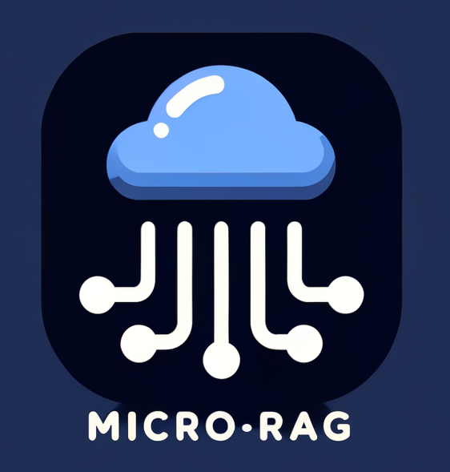

<div align="center">
  
</div>

# Micro RAG

A minimalist command-line tool for Retrieval-Augmented Generation (RAG) chat with your documents using local LLMs via Ollama.

## Features

- Chat with your documents using RAG technology
- Uses local LLMs via Ollama
- Simple and intuitive command-line interface
- Supports various document formats
- Streaming responses with source citations

## Installation

```bash
# Clone this repository
git clone https://github.com/yourusername/minimal-rag.git
cd minimal-rag

# Install dependencies
pip install -r requirements.txt

# Make the script executable
chmod +x micro-rag.py
```

## Usage

Basic usage:

```bash
python micro-rag.py /path/to/documents
```

With custom models:

```bash
python micro-rag.py /path/to/documents --chat-model "llama3:latest" --embed-model "nomic-embed-text"
```

Full options:

```bash
python micro-rag.py --help
```

### Example

```shell
                                                                                                                                                                       (micro-rag) 
Minimal RAG Chat Tool
Documents: data/wikipedia-ai/
Chat Model: olmo2:7b
Embedding Model: nomic-embed-text
--------------------------------------------------
Using Ollama at: http://localhost:11434
✔ Chat model olmo2:7b loaded successfully
✔ Embedding model nomic-embed-text loaded successfully
⠹ Loading documents from data/wikipedia-ai/ ━━━━━━━━━━━━━━━━━━━━━━━━━━━━━━━━━━━━━━━━ 0/3 • 0:00:00
✓ Loaded 3 document(s)
  Building vector index ━━━━━━━━━━━━━━━━━━━━━━━━━━━━━━━━━━━━━━━━ 0:00:05
✓ Vector index built successfully

RAG Chat initialized. Type 'exit' or 'quit' to end the session.


You: Who proposed the first artificial neuron?

AI:  Warren McCulloch and Walter Pitts proposed the first artificial neuron in their 1943 paper titled "A Logical Calculus of Ideas Immanent in Nervous Activity."

--------------------------------------------------
```

### Command-line Arguments

- `documents_dir`: Directory containing the documents to chat with (required)
- `--chat-model`: Ollama chat model to use (default: "orca-mini:13b")
- `--embed-model`: Ollama embedding model to use (default: "nomic-embed-text")
- `--ollama-host`: Ollama host URL (default: http://localhost:11434 or OLLAMA_HOST env variable)
- `--chunk-size`: Size of document chunks (default: 512)
- `--chunk-overlap`: Overlap between document chunks (default: 50)

## Requirements

- Python 3.8+
- Ollama running locally or remotely
- Available models in Ollama for chat and embeddings

## Notes

- The first run will download the models if they aren't already available in Ollama
- Type 'exit' or 'quit' to end the chat session
- Press Ctrl+C to interrupt the chat

## License

MIT
